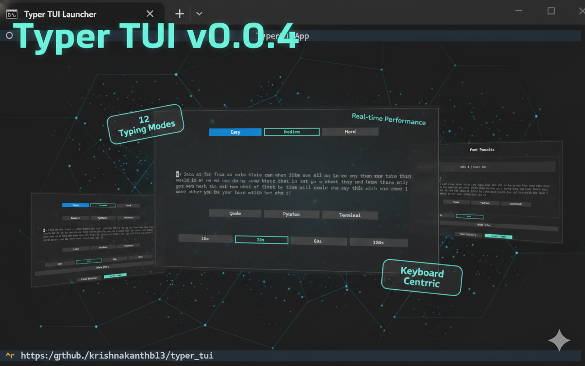

# Typer TUI

[](./LICENSE)

A minimal, offline, terminal-based typing test built with Python and [Textual](https://textual.textualize.io/).



Inspired by [boomtypr](https://github.com/yagnikpt/boomtypr).

## Features

- **Clean Interface**: Distraction-free TUI environment.
- **12 Unique Typing Modes**:
  - *Difficulty*: Easy, Medium, Hard
  - *Special*: Numbers, Symbols, Twisters (tongue twisters)
  - *Creative*: Quotes, Stories, Zen (meditative phrases)
  - *Developer*: Code, Python, Terminal (CLI commands)
- **Real-time Stats**: WPM, Accuracy, and Timer update live.
- **History Tracking**: View your past performance.
- **Keyboard Centric**: Navigate the entire UI without a mouse.

## Installation

1. Clone the repository.
2. Run the launcher script (Handling dependencies automatically):

   **Windows**:
   Double-click `run.bat` or run it from the command line:
   ```cmd
   .\run.bat
   ```
   This script will:
   1. Check if Python is installed.
   2. Check if dependencies are already installed globally (skips `venv` if so).
   3. If not global, attempts to activate `venv/` if it exists.
   4. Install missing dependencies (`textual`) if neither of the above works.
   5. Launch the application.

   **Mac/Linux**:
   Run the shell script:
   ```bash
   chmod +x run.sh
   ./run.sh
   ```
   This script performs the same checks as the Windows version.

## Documentation

*   [Code Documentation](./CODE_DOCUMENTATION.md): Architecture and modules.
*   [Design Philosophy](./DESIGN_PHILOSOPHY.md): Why we built this.

## Contributing

We welcome contributions! Please see [CONTRIBUTING.md](./CONTRIBUTING.md) for guidelines on how to get started.

## License

This project is licensed under the [GPL v3 License](./LICENSE).
Copyright (C) 2026 Krishna Kanth B
